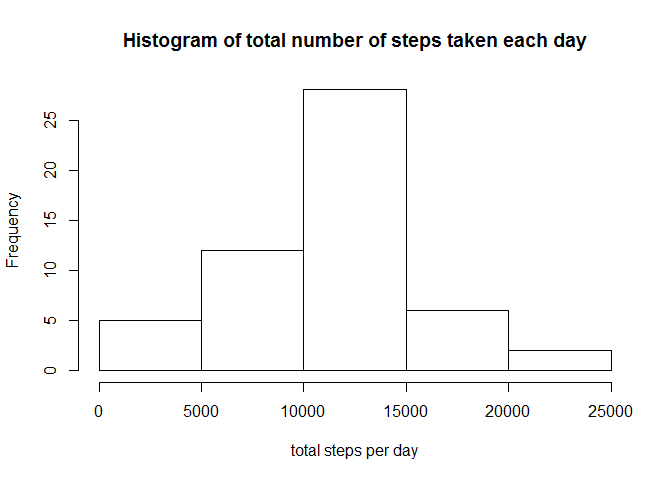
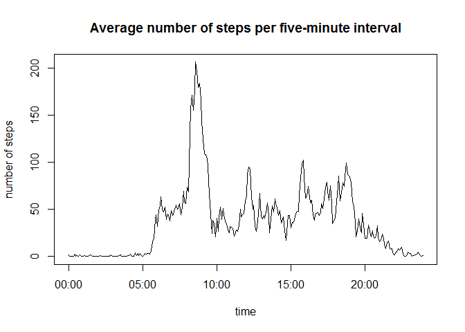
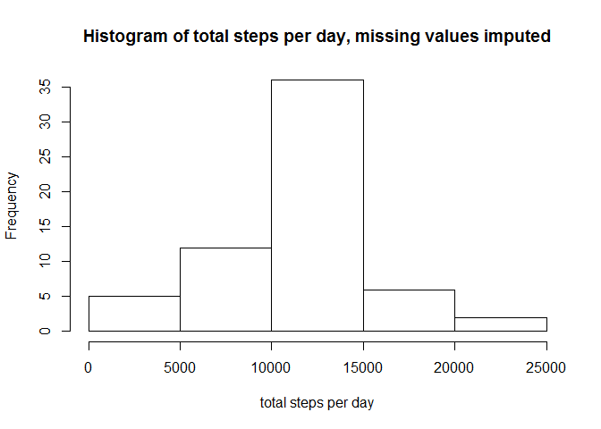
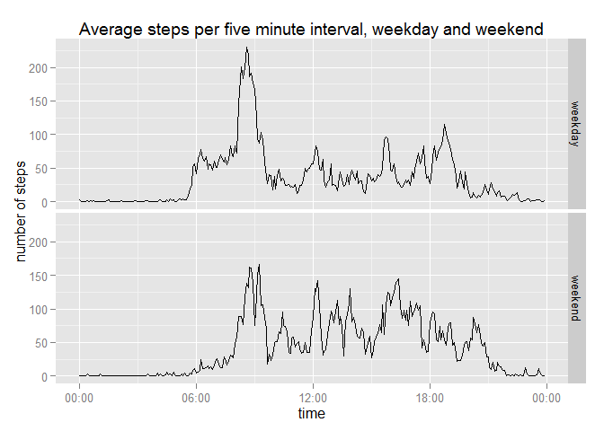

# Reproducible Research: Peer Assessment 1


## Loading and preprocessing the data

```r
library("dplyr")
```

```
## 
## Attaching package: 'dplyr'
## 
## The following object is masked from 'package:stats':
## 
##     filter
## 
## The following objects are masked from 'package:base':
## 
##     intersect, setdiff, setequal, union
```

```r
library("ggplot2")
library("scales")

temp <- tempfile()
download.file("http://d396qusza40orc.cloudfront.net/repdata%2Fdata%2Factivity.zip", temp)
unzip(temp)
data <- read.csv("activity.csv")
unlink(temp)
data$date <- as.Date(data$date)
```


## What is mean total number of steps taken per day?

```r
## remove incomplete cases, sum data by day
data1 <- data[complete.cases(data),]
daily <- group_by(data1, date)
totals <- summarize(daily, steps = sum(steps))

## create histogram
hist(totals$steps, main = "Histogram of total number of steps taken each day", xlab = "total steps per day")
```

 

```r
## calculate mean and median
mean_steps <- mean(totals$steps)
median_steps <- median(totals$steps)
```
Mean total number of steps taken each day: 10766

Median total number of steps taken each day: 10765

## What is the average daily activity pattern?

```r
## calculate average number of steps for each interval
minutes <- group_by(data1, interval)
intervals <- summarize(minutes, steps = mean(steps))

## add column with interval converted to POSIX time
## this will make a smooth time series plot
intervals$time <- sprintf("%04d", intervals$interval)
intervals$time <- as.POSIXct(intervals$time, format = "%H%M")

## create plot
plot(intervals$time, intervals$steps, type = "l", main = "Average number of steps per five-minute interval", xlab = "time", ylab = "number of steps")
```

 

```r
## find interval with max number of steps
max_steps <- filter(intervals, steps == max(steps))
```
The interval 835 contains the maximum number of steps.


## Imputing missing values

```r
## compute number of incomplete cases
missing <- sum(!complete.cases(data))
```
Number of rows with NAs: 2304

To fill in missing values, I used the mean for that five-minute interval as calculated using complete cases.


```r
## find mean number of steps for each interval , complete cases only, and merge with original data
mean_int <- summarize(minutes, meansteps = round(mean(steps)))
df <- merge(data, mean_int, by = "interval")

## this function replaces NAs in the steps columns with the mean number of steps for that row
for (i in 1:nrow(df)) {
    if (is.na(df$steps[i])) {
        df$steps[i] <- df$meansteps[i]
    }
}

## find total steps for each day
df <- group_by(df, date)
steps_complete <- summarize(df, steps = sum(steps))

## create histogram
hist(steps_complete$steps, main = "Histogram of total steps per day, missing values imputed", xlab = "total steps per day")
```

 

```r
## compute mean and median
mean_complete <- mean(steps_complete$steps)
median_complete <- median(steps_complete$steps)
```
Mean total number of steps taken per day: 10765

Median total number of steps taken per day: 10762

These values are not significantly different from the values calculated with the missing data omitted. It appears that imputing the missing data has no impact on the estimates.


## Are there differences in activity patterns between weekdays and weekends?

```r
## add factor variable denoting weekday or weekend
df$weekday <- weekdays(df$date)
df$weekday <- ifelse(df$weekday == "Saturday" | df$weekday == "Sunday", "weekend", "weekday")
df$weekday <- factor(df$weekday)

## find avg number of steps per interval for weekdays and weekends
wd <- group_by(df, interval, weekday)
wd1 <- summarize(wd, steps = mean(steps))

## add column with interval converted to POSIX time
## makes a smooth time series plot
wd1$time <- sprintf("%04d", wd1$interval)
wd1$time <- as.POSIXct(wd1$time, format = "%H%M")

## create plot
g <- ggplot(wd1, aes(time, steps))
g + geom_line() + scale_x_datetime(labels = date_format("%H:%M")) + facet_grid(weekday ~ .) + ggtitle("Average steps per five minute interval, weekday and weekend") + ylab("number of steps")
```

 
